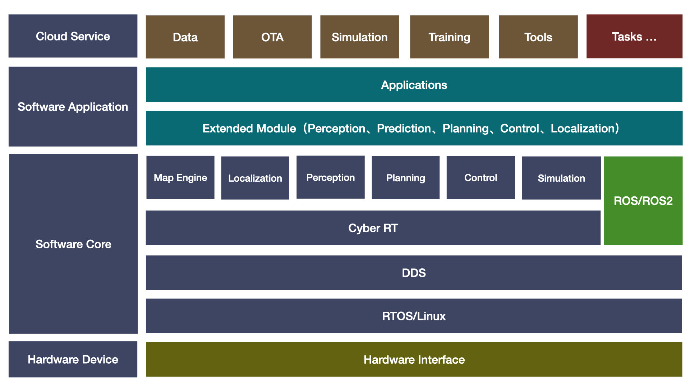

# openbot

## :golf: Openbot Framework



## :seedling:  简介

> **<font color='green'>openbot</font>** 不依赖 **<font color='red'>ROS/ROS2</font>** 的机器人视觉定位&建图、导航系统框架，完全由C++开发。打造一个linux系统级别，支持分布式、高吞吐、低延时、易部署、易调试、高性能的机器人算法框架：
>
> * 支持CyberRT通信机制
> * 支持mqtt、grpc、zmq、http网络通信机制 **（TODO）**
> * 支持原生ROS/ROS2通用msgs消息格式
> * 支持3D视觉SLAM建图 **（TODO）**
> * 支持2D/3D占用栅格地图全局路径规划，以及全局路径的动态库插件化 **（TODO）**
> * 支持3D路径跟踪和物体跟随控制，以及控制器的动态库插件化 **（TODO）**
> * 支持数据、算法和ROS2数据生态互联与应用扩展
> * 支持docker 
> * 支持cmake、bazel系统编译
> * 支持行为树调度 
> * 完善的说明文档和使用文档 

## :shamrock:工程代码

```bash
# openbot
git clone https://github.com/AibotBeginer/openbot.git
```

## :tanabata_tree:详细文档

**<font color='green'>参考</font>** ：[openbot详细文档](https://openbot-doc.readthedocs.io/en/latest/)

##  :cactus: 编译

```bash
cd openbot
mkdir build && cd build && cmake ..
make -j8
sudo make install
```

##  :desert_island: 环境变量

```bash
# .bashrc 或者.zshrc，添加一下环境变量
export CYBER_PATH=/usr/local/share/
export GLOG_logtostderr=1
export GLOG_alsologtostderr=0
export GLOG_colorlogtostderr=1
export GLOG_minloglevel=0
```

## :four_leaf_clover: 运行

```bash
source /opt/cyber/setup.bash或者source /opt/cyber/setup.zsh
./application.system_main
```

