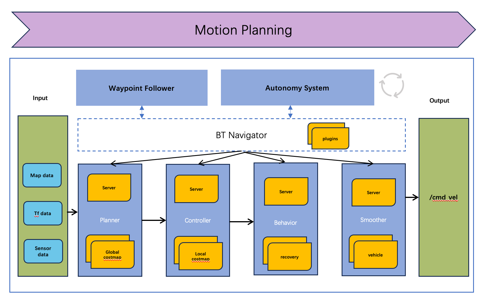

# **8 路径规划**


## 1 简介




## 2 参数描述


## 3 程序运行

*  启动planning_component模块（only planning_component）

```bash
cyber_launch start /opt/openbot/share/openbot/planning/launch/planning.launch
```

* 启动系统导航模块（包含planning_component）

```bash
cd /opt/openbot/share/openbot/launch
python3 ./openbot.planning.launch.py
```

结果如下：

```bash
quandy@quandy [/opt/openbot/share/openbot/launch] ➜  python3 ./openbot.planning.launch.py                                                                                                        [14:14:40]
/opt/cyber/cyber_tools_auto_complete.bash:77: command not found: complete
/opt/cyber/cyber_tools_auto_complete.bash:78: command not found: complete
/opt/cyber/cyber_tools_auto_complete.bash:79: command not found: complete
/opt/cyber/cyber_tools_auto_complete.bash:80: command not found: complete
/opt/cyber/cyber_tools_auto_complete.bash:81: command not found: complete
Starting command: ['/opt/openbot/bin/application.talker_main']
Starting command: ['cyber_launch', 'start', '/opt/openbot/share/openbot/planning/launch/planning.launch']
[cyber_launch_121365] INFO Launch file [/opt/openbot/share/openbot/planning/launch/planning.launch]
[cyber_launch_121365] INFO ========================================================================================================================
[cyber_launch_121365] INFO Load module [planning] library: [planning] [CYBER_DEFAULT] conf, exception_handler: [], respawn_limit: [3]
/opt/cyber/bin/cyber_launch:189: DeprecationWarning: setDaemon() is deprecated, set the daemon attribute instead
  th.setDaemon(True)
[cyber_launch_121365] INFO Start process [planning] successfully. pid: 121366
[cyber_launch_121365] INFO ------------------------------------------------------------------------------------------------------------------------
[planning]  WARNING: Logging before InitGoogleLogging() is written to STDERR
[planning]  I1211 14:16:22.233747 121366 module_argument.cc:89] []command: mainboard -d /opt/openbot/share/openbot/planning/dag/planning.dag -p planning -s CYBER_DEFAULT 
[planning]  I1211 14:16:22.233942 121366 global_data.cc:153] []host ip: 192.168.3.45
[planning]  I1211 14:16:22.237526 121366 module_argument.cc:62] []binary_name_ is mainboard, process_group_ is planning, has 1 dag conf
[planning]  I1211 14:16:22.237541 121366 module_argument.cc:65] []dag_conf: /opt/openbot/share/openbot/planning/dag/planning.dag
[planning]  W1211 14:16:22.237637 121366 scheduler_factory.cc:63] [mainboard]Scheduler conf named /opt/cyber/share/conf/planning.conf not found, use default.
[planning]  I1211 14:16:22.237787 121369 processor.cc:42] [mainboard]processor_tid: 121369
[planning]  I1211 14:16:22.237856 121370 processor.cc:42] [mainboard]processor_tid: 121370
[planning]  I1211 14:16:22.237938 121371 processor.cc:42] [mainboard]processor_tid: 121371
[planning]  I1211 14:16:22.238015 121372 processor.cc:42] [mainboard]processor_tid: 121372
[planning]  I1211 14:16:22.238085 121373 processor.cc:42] [mainboard]processor_tid: 121373
[planning]  I1211 14:16:22.238153 121374 processor.cc:42] [mainboard]processor_tid: 121374
[planning]  I1211 14:16:22.238193 121375 processor.cc:42] [mainboard]processor_tid: 121375
[planning]  I1211 14:16:22.238248 121376 processor.cc:42] [mainboard]processor_tid: 121376
[planning]  I1211 14:16:22.238340 121377 processor.cc:42] [mainboard]processor_tid: 121377
[planning]  I1211 14:16:22.238377 121378 processor.cc:42] [mainboard]processor_tid: 121378
[planning]  I1211 14:16:22.238440 121379 processor.cc:42] [mainboard]processor_tid: 121379
[planning]  I1211 14:16:22.238526 121380 processor.cc:42] [mainboard]processor_tid: 121380
[planning]  I1211 14:16:22.238603 121381 processor.cc:42] [mainboard]processor_tid: 121381
[planning]  I1211 14:16:22.238680 121382 processor.cc:42] [mainboard]processor_tid: 121382
[planning]  I1211 14:16:22.238766 121383 processor.cc:42] [mainboard]processor_tid: 121383
[planning]  I1211 14:16:22.238804 121384 processor.cc:42] [mainboard]processor_tid: 121384
[planning]  I1211 14:16:22.238813 121366 init.cc:113] [mainboard]Register exit handle succ.
[planning]  W1211 14:16:22.238831 121366 environment.h:33] [mainboard]Environment variable [APOLLO_PLUGIN_SEARCH_IN_BAZEL_OUTPUT] not set, fallback to 
[planning]  W1211 14:16:22.238837 121366 environment.h:33] [mainboard]Environment variable [APOLLO_PLUGIN_INDEX_PATH] not set, fallback to 
[planning]  W1211 14:16:22.238842 121366 environment.h:33] [mainboard]Environment variable [APOLLO_DISTRIBUTION_HOME] not set, fallback to 
[planning]  I1211 14:16:22.238847 121366 plugin_manager.cc:177] [mainboard]loading plugins from APOLLO_PLUGIN_INDEX_PATH[]
[planning]  W1211 14:16:22.238852 121366 plugin_manager.cc:188] [mainboard]plugin index path[] not exists
[planning]  I1211 14:16:22.238860 121366 module_controller.cc:58] [mainboard]mainboard: use dag conf /opt/openbot/share/openbot/planning/dag/planning.dag
[planning]  I1211 14:16:22.239516 121366 module_controller.cc:67] [mainboard]Start initialize dag: /opt/openbot/share/openbot/planning/dag/planning.dag
[planning]  I1211 14:16:22.239593 121366 module_controller.cc:85] [mainboard]mainboard: use module library /opt/openbot/lib/libplanning_component.so
[planning]  I1211 14:16:22.239601 121366 class_loader.cc:37] [mainboard]Begin LoadLibrary: /opt/openbot/lib/libplanning_component.so
WARNING: Logging before InitGoogleLogging() is written to STDERR
I1211 14:16:22.253609 121364 class_loader_utility.h:79] []registerclass:ControllerComponent,apollo::cyber::ComponentBase,
I1211 14:16:22.253710 121364 class_loader_utility.h:79] []registerclass:PlanningComponent,apollo::cyber::ComponentBase,
I1211 14:16:22.262964 121364 global_data.cc:153] [application.talker_main]host ip: 192.168.3.45
W1211 14:16:22.266294 121364 scheduler_factory.cc:63] [application.talker_main]Scheduler conf named /opt/cyber/share/conf/application.talker_main_121364.conf not found, use default.
I1211 14:16:22.266532 121386 processor.cc:42] [application.talker_main]processor_tid: 121386
I1211 14:16:22.266592 121387 processor.cc:42] [application.talker_main]processor_tid: 121387
I1211 14:16:22.266657 121388 processor.cc:42] [application.talker_main]processor_tid: 121388
I1211 14:16:22.266775 121389 processor.cc:42] [application.talker_main]processor_tid: 121389
I1211 14:16:22.266839 121390 processor.cc:42] [application.talker_main]processor_tid: 121390
I1211 14:16:22.266912 121391 processor.cc:42] [application.talker_main]processor_tid: 121391
```

