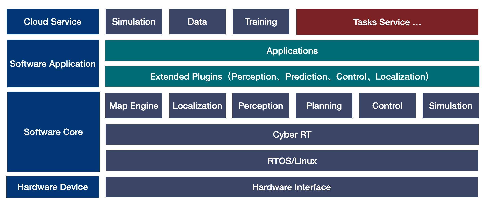

.. Copyright 2024 The OpenRobotic Beginner Authors

.. Licensed under the Apache License, Version 2.0 (the "License");
   you may not use this file except in compliance with the License.
   You may obtain a copy of the License at

..      http://www.apache.org/licenses/LICENSE-2.0

.. Unless required by applicable law or agreed to in writing, software
   distributed under the License is distributed on an "AS IS" BASIS,
   WITHOUT WARRANTIES OR CONDITIONS OF ANY KIND, either express or implied.
   See the License for the specific language governing permissions and
   limitations under the License.

============
Openbot
============

.. toctree::
   :maxdepth: 2
   :hidden:

`Openbot <https://github.com/AibotBeginer/openbot>`_ is a system that provides robot framework.

github
----------------

.. code-block:: bash

   git clone --recurse-submodules https://github.com/AibotBeginer/openbot.git
   

Contents
----------------

.. toctree::
  :maxdepth: 1

  01 Instructions <01_Instructions/what_openbot>
  02 Installation <02_Installation/prerequisite_software_installation_guide>
  03 Hardware <02_Installation/prerequisite_software_installation_guide>
  04 Map <02_Installation/prerequisite_software_installation_guide>
  05 Localization <02_Installation/prerequisite_software_installation_guide>
  06 Perception <02_Installation/prerequisite_software_installation_guide>
  07 Prediction <02_Installation/prerequisite_software_installation_guide>
  08 Planning <02_Installation/prerequisite_software_installation_guide>
  09 Decider <02_Installation/prerequisite_software_installation_guide>
  10 Control <02_Installation/prerequisite_software_installation_guide>
  11 Others <02_Installation/prerequisite_software_installation_guide>
  12 FAQS <02_Installation/prerequisite_software_installation_guide>

